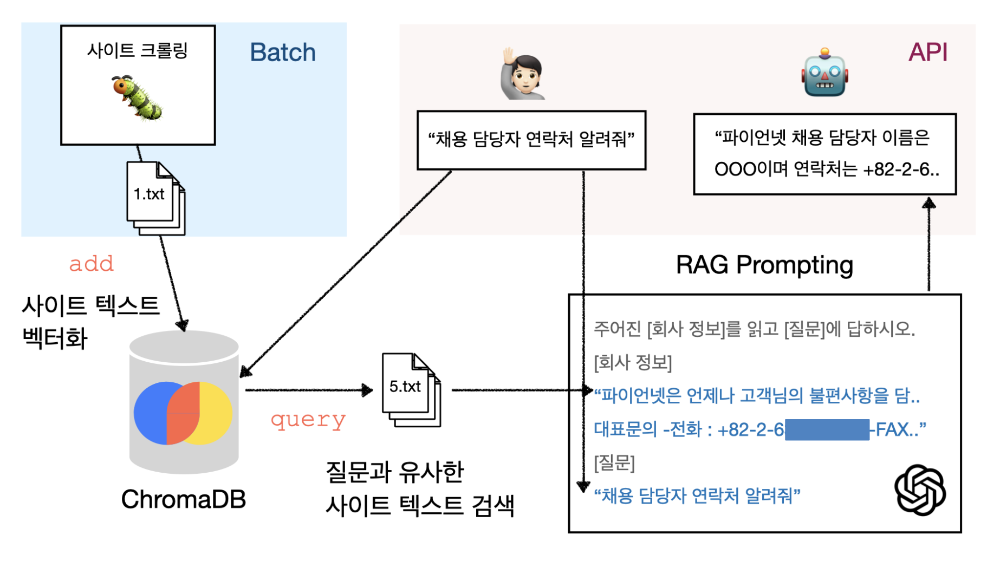

# 똑똑한 파이언월드 챗봇

## 프로젝트 구조



## 기술 스택

| 구분       |                                                             |
|----------|-------------------------------------------------------------|
| FE       | JavaScript, HTML, CSS                                       |
| BE       | FastAPI, uvicorn                                            |
| 모델       | SentenceTransformer (paraphrase-multilingual-MiniLM-L12-v2) |
| API      | OpenAI Completion API                                       |
| VectorDB | chromaDB                                                    |
| 데이터셋     | 크롤링 -> 파이언넷 공식 홈페이지 텍스트                                     |

## 프로젝트 초기화하기

1. 공유 드라이브에서 <u>`AI_config.py` 파일</u>을 <u>다운로드</u> 받아서 toy4 루트에
   저장. [파일 링크](https://drive.google.com/file/d/1UAStfzIr1xAdKiVvdcf_CsyR6RZNHxQb/view?usp=drive_link)
2. 터미널에서 `init.sh` 스크립트 실행.

```shell
# 리눅스 shell
sh init.sh
```

3. API 가동할 준비가 되면 crawler_data, db_client 폴더들이 생성됩니다. (첨부이미지)<br>
   </img>

## (초기화 이후) 챗봇 가동하기

1. 터미널에서 `deploy.sh` 스크립트를 실행하면 http://localhost:8000/ 에 챗봇이 뜹니다.

```shell
# 리눅스 shell
sh deploy.sh
```

2. 프로세스 실행종료시에는 ctrl+c (맥OS)